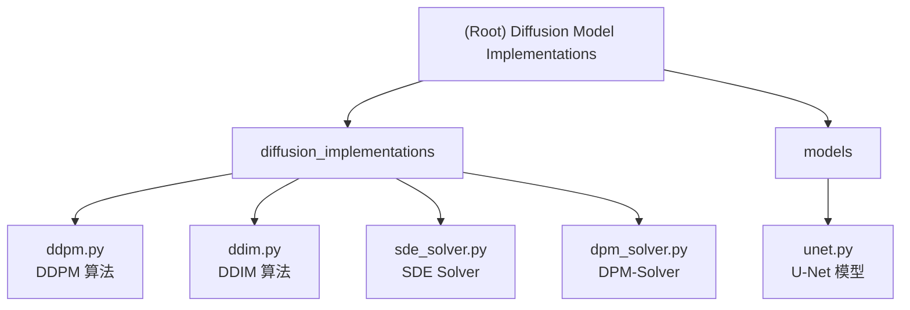

# Diffusion Model Implementations - 即插即用的扩散模型框架

**最后更新时间**: 2025-11-12T19:06:30+08:00

---

## 变更日志 (Changelog)

### 2025-11-12
- 初始化项目 AI 上下文文档
- 创建根级和模块级 CLAUDE.md
- 生成项目结构图和模块索引

---

## 项目愿景

本项目致力于构建一个**灵活、可扩展、即插即用**的扩散模型框架，通过统一的配置文件（`config.yaml`）轻松切换四种主流扩散算法：

- **DDPM** (Denoising Diffusion Probabilistic Models) - 基于 Markov 链的经典去噪模型
- **DDIM** (Denoising Diffusion Implicit Models) - 支持跳步加速采样（50 步替代 1000 步）
- **SDE Solver** (Stochastic Differential Equation Solver) - 基于随机微分方程的连续时间建模
- **DPM-Solver** (Diffusion Probabilistic Model Solver) - 快速高阶 ODE 求解器（10-20 步采样）

**核心特性**：
- 所有算法遵循统一接口规范（`forward_sample`, `reverse_sample`, `reverse_sample_loop`）
- 通过 `config.yaml` 一键切换算法，无需修改代码
- 完整的类型提示和 Google 风格文档字符串
- 每个模块包含独立测试样例，保证功能正确性

---

## 架构概览

本项目采用**模块化设计**，清晰分离算法实现和神经网络模型：

```
项目根目录/
├── config.yaml                   # 全局配置文件（算法选择、超参数）
├── diffusion_implementations/    # 扩散算法实现模块
│   ├── __init__.py              # 导出 DDPM, DDIM, SDESolver, DPMSolver
│   ├── ddpm.py                  # DDPM 算法实现（含测试）
│   ├── ddim.py                  # DDIM 算法实现（含测试）
│   ├── sde_solver.py            # SDE Solver 算法实现（含测试）
│   └── dpm_solver.py            # DPM-Solver 算法实现（含测试）
└── models/                       # 神经网络模型模块
    ├── __init__.py              # 导出 SimpleUNet, UNet
    └── unet.py                  # U-Net 噪声预测模型（含测试）
```

**设计原则**：
1. **统一接口**：所有扩散算法继承 `nn.Module`，实现三个核心方法
2. **配置驱动**：通过 `config.yaml` 控制所有行为，避免硬编码
3. **类型安全**：所有函数参数和返回值包含类型提示
4. **文档优先**：代码即文档，Google 风格 docstring
5. **测试驱动**：每个实现文件包含 `if __name__ == "__main__"` 测试块

---

## 模块结构图



---

## 模块索引

| 模块路径 | 职责描述 | 状态 | 文档链接 |
|---------|---------|------|---------|
| **diffusion_implementations** | 四种扩散算法的统一接口实现 | 已完成 | [查看文档](./diffusion_implementations/CLAUDE.md) |
| **models** | 噪声预测神经网络（U-Net） | 部分完成 | [查看文档](./models/CLAUDE.md) |

### 扩散算法模块详情

| 文件 | 算法 | 特点 | 采样步数 | 状态 |
|-----|------|-----|---------|------|
| `ddpm.py` | DDPM | 经典 Markov 链去噪 | 1000 步 | 已实现 |
| `ddim.py` | DDIM | 确定性跳步采样 | 50-1000 步可调 | 已实现 |
| `sde_solver.py` | SDE Solver | 连续时间 SDE 建模 | 100-1000 步 | 已实现 |
| `dpm_solver.py` | DPM-Solver | 高阶 ODE 求解器 | 10-20 步 | 已实现 |

### 模型模块详情

| 文件 | 模型 | 用途 | 状态 |
|-----|------|------|------|
| `unet.py` | SimpleUNet | 快速测试扩散算法 | 已实现 |
| `unet.py` | UNet | 生产级噪声预测（完整 U-Net） | 占位符 |

---

## 运行和开发

### 环境要求

- **Python**: 3.10+
- **核心依赖**:
  - PyTorch >= 1.13
  - NumPy >= 1.21
  - PyYAML (用于配置解析)

### 快速测试

每个算法模块都包含独立的测试代码：

```bash
# 测试 DDPM 算法
python diffusion_implementations/ddpm.py

# 测试 DDIM 算法
python diffusion_implementations/ddim.py

# 测试 SDE Solver
python diffusion_implementations/sde_solver.py

# 测试 DPM-Solver
python diffusion_implementations/dpm_solver.py

# 测试 U-Net 模型
python models/unet.py
```

### 配置使用

通过修改 `config.yaml` 切换算法：

```yaml
diffusion:
  implementation: 'ddpm'  # 可选: 'ddpm', 'ddim', 'sde_solver', 'dpm_solver'
  timesteps: 1000
  beta_start: 0.0001
  beta_end: 0.02
  beta_schedule: 'linear'  # 可选: 'linear', 'cosine'

  # DDIM 专用参数
  ddim:
    eta: 0.0          # 0=确定性, 1=DDPM等价
    skip_steps: 50    # 跳步采样步数

  # DPM-Solver 专用参数
  dpm_solver:
    solver_order: 2   # 求解器阶数 (1/2/3)
    prediction_type: 'epsilon'  # 'epsilon' / 'sample'

model:
  in_channels: 1      # 输入通道数
  out_channels: 1     # 输出通道数
  type: 'simple_unet' # 'simple_unet' / 'unet'

global:
  device: 'cuda'      # 'cuda' / 'cpu'
```

### 代码示例

```python
import torch
from diffusion_implementations import DDPM, DDIM, SDESolver, DPMSolver
from models import SimpleUNet

# 初始化算法和模型
ddpm = DDPM(n_timesteps=1000, beta_start=0.0001, beta_end=0.02)
model = SimpleUNet(in_channels=1, out_channels=1)

# 前向加噪
x_0 = torch.randn(4, 1, 28, 28).cuda()
t = torch.randint(0, 1000, (4,)).cuda()
x_t, noise = ddpm.forward_sample(x_0, t)

# 单步反向去噪
condition = torch.randn(4, 1, 28, 28).cuda()
x_t_minus_1 = ddpm.reverse_sample(x_t, t, condition, model)

# 完整采样循环
x_T = torch.randn(4, 1, 28, 28).cuda()
x_0_generated = ddpm.reverse_sample_loop(x_T, condition, model)
```

---

## 测试策略

### 单元测试覆盖

每个算法模块的 `if __name__ == "__main__"` 块测试以下内容：

1. **初始化测试**：验证参数计算正确性（beta、alpha、alpha_bar 等）
2. **前向加噪测试**：验证 `forward_sample` 输出形状和数值合理性
3. **单步去噪测试**：验证 `reverse_sample` 输出形状
4. **完整采样循环测试**：验证 `reverse_sample_loop` 从噪声生成数据
5. **边界条件测试**：验证 t=0 和 t=T-1 的特殊处理

### 测试数据规格

- **图像尺寸**：28×28（MNIST 尺寸）
- **通道数**：1（灰度图）
- **批次大小**：4
- **时间步数**：完整测试 1000 步，快速测试 50-100 步

### 运行所有测试

```bash
# Windows (CMD)
for %f in (diffusion_implementations\*.py) do python %f
python models\unet.py

# Linux/macOS
for file in diffusion_implementations/*.py; do python "$file"; done
python models/unet.py
```

---

## 编码标准

本项目严格遵循以下编码规范（详见 [coding_paradigm.md](./coding_paradigm.md)）：

### 命名约定

| 类型 | 规则 | 示例 |
|------|------|------|
| 类 | `PascalCase` | `DDPM`, `SimpleUNet` |
| 函数/方法 | `snake_case` | `forward_sample`, `reverse_sample_loop` |
| 变量 | `snake_case` | `x_t`, `alpha_bar`, `beta_schedule` |
| 常量 | `UPPER_SNAKE_CASE` | `DEFAULT_TIMESTEPS` |
| 私有成员 | `_snake_case` | `_extract_coefficients`, `_linear_beta_schedule` |

### 文档字符串规范

```python
def forward_sample(
    self,
    x_0: torch.Tensor,
    t: torch.Tensor
) -> Tuple[torch.Tensor, torch.Tensor]:
    """
    前向加噪过程: x_0 -> x_t。

    根据重参数化技巧直接从 x_0 采样 x_t。

    Args:
        x_0 (torch.Tensor): 原始无噪声数据。
            shape: (batch_size, channels, height, width)
        t (torch.Tensor): 时间步索引（0 到 T-1）。
            shape: (batch_size,)

    Returns:
        Tuple[torch.Tensor, torch.Tensor]:
            - x_t: 加噪后的数据，shape 与 x_0 相同。
            - noise: 采样的标准高斯噪声，shape 与 x_0 相同。

    Example:
        >>> ddpm = DDPM(n_timesteps=1000)
        >>> x_0 = torch.randn(4, 1, 28, 28)
        >>> t = torch.randint(0, 1000, (4,))
        >>> x_t, noise = ddpm.forward_sample(x_0, t)
    """
```

### 类型提示要求

- 所有公有函数和方法必须包含完整类型提示
- 使用 `typing` 模块的泛型类型（`Tuple`, `List`, `Optional`）
- 返回值必须明确标注（包括 `None`）

---

## AI 使用指南

### 与 AI 协作的最佳实践

1. **代码修改请求**：
   - 明确指定要修改的文件路径（使用绝对路径）
   - 说明修改目的和预期行为
   - 要求 AI 保持现有编码风格和文档规范

2. **新功能开发**：
   - 参考现有算法模块的实现模式
   - 要求生成完整的类型提示和文档字符串
   - 要求包含测试代码块

3. **文档更新**：
   - 修改代码后，要求 AI 同步更新对应的 CLAUDE.md
   - 在变更日志中记录修改内容

### 常见 AI 提示词示例

```
"请在 diffusion_implementations/ddpm.py 中添加余弦 beta 调度的支持，
并在测试模块中验证其正确性。保持现有的代码风格和文档规范。"

"请帮我完成 models/unet.py 中的 UNet 类实现，包括：
- 时间步嵌入层
- 下采样和上采样路径
- 残差块和注意力模块
- 跳跃连接
并包含完整的类型提示和测试代码。"

"请更新 diffusion_implementations/CLAUDE.md，添加关于 DDIM
跳步采样的详细说明和使用示例。"
```

---

## 参考资源

### 核心论文

- **DDPM**: Ho et al., "Denoising Diffusion Probabilistic Models" (NeurIPS 2020)
- **DDIM**: Song et al., "Denoising Diffusion Implicit Models" (ICLR 2021)
- **SDE**: Song et al., "Score-based Generative Modeling through SDEs" (ICLR 2021)
- **DPM-Solver**: Lu et al., "DPM-Solver: A Fast ODE Solver for Diffusion" (NeurIPS 2022)

### 实现参考

- [Hugging Face Diffusers](https://github.com/huggingface/diffusers)
- [OpenAI Guided Diffusion](https://github.com/openai/guided-diffusion)
- [PyTorch U-Net](https://github.com/milesial/Pytorch-UNet)

### 教程资源

- [Lil'Log: What are Diffusion Models?](https://lilianweng.github.io/posts/2021-07-11-diffusion-models/)
- [The Annotated Diffusion Model](https://huggingface.co/blog/annotated-diffusion)

---

## 项目状态

### 已完成功能

- [x] DDPM 算法完整实现（含线性和余弦调度）
- [x] DDIM 算法完整实现（支持跳步采样）
- [x] SDE Solver 算法完整实现（VP-SDE）
- [x] DPM-Solver 算法完整实现（1/2/3 阶求解器）
- [x] SimpleUNet 测试模型实现
- [x] 所有算法模块的独立测试
- [x] 统一接口规范和类型提示
- [x] 完整的代码文档（Google 风格）

### 待完成功能

- [ ] 完整的 UNet 模型实现（含时间嵌入、注意力、残差块）
- [ ] 基于配置文件的算法工厂类
- [ ] 训练循环实现
- [ ] 采样脚本和可视化工具
- [ ] MNIST/CIFAR-10 数据集训练示例
- [ ] 模型检查点保存和加载
- [ ] 条件生成支持（类别标签、文本提示）

### 技术债务

- [ ] UNet 当前为占位符实现，需要完整开发
- [ ] 缺少配置解析和验证模块
- [ ] 缺少日志记录系统
- [ ] 缺少性能分析和优化

---

## 贡献指南

### 添加新算法

1. 在 `diffusion_implementations/` 创建新文件（如 `new_algorithm.py`）
2. 继承 `nn.Module`，实现三个核心方法：
   - `forward_sample(x_0, t)`
   - `reverse_sample(x_t, t, condition, model)`
   - `reverse_sample_loop(x_T, condition, model)`
3. 添加完整的类型提示和文档字符串
4. 包含测试代码块（`if __name__ == "__main__"`）
5. 在 `__init__.py` 中导出新类
6. 更新 `CLAUDE.md` 文档

### 代码审查清单

- [ ] 符合 PEP 8 标准
- [ ] 所有函数包含类型提示
- [ ] 所有公有 API 包含 Google 风格文档字符串
- [ ] 变量命名使用完整单词（避免缩写）
- [ ] 包含独立的测试代码
- [ ] 测试覆盖核心功能和边界条件
- [ ] 输出形状与输入一致
- [ ] 设备兼容（CPU/CUDA）

---

## 联系和支持

本项目为教学示例项目，用于演示如何构建模块化、可扩展的扩散模型框架。

**文档最后更新**: 2025-11-12T19:06:30+08:00
**项目路径**: `D:\Tutorials\tutorials_for_claude_code\diffusion_model_implementations`
